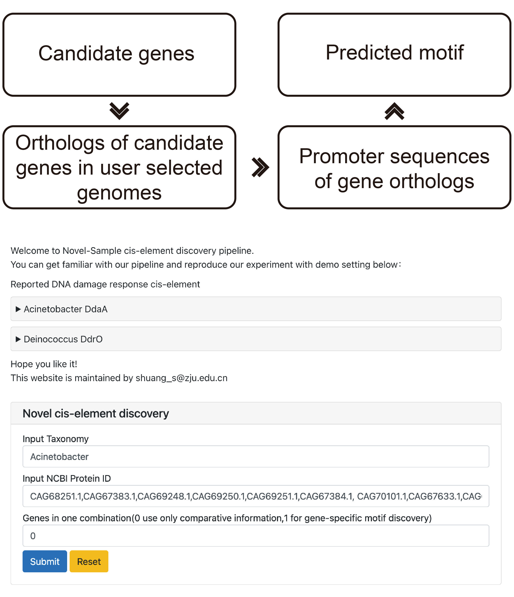

# Novel-Sample 
The main_program.ipynb is used to build a website for easy use of transcriptional regulator discovery, while the demo.ipynb contains function to do the analysis. The R program is used to visualize the logo plot. 

