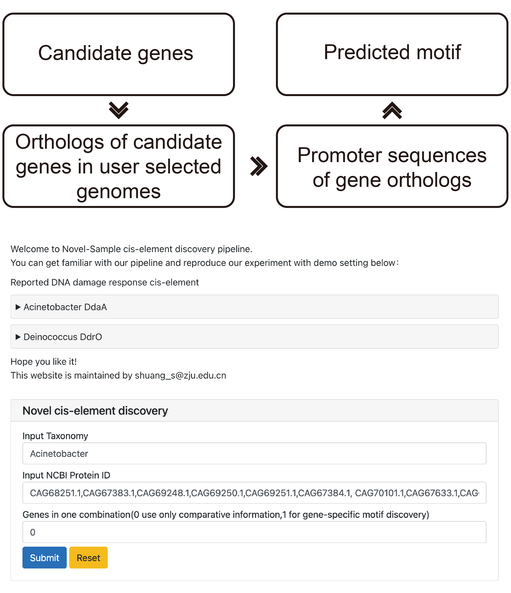

# Novel Cis-Element Discovery Pipeline

[](https://www.python.org/downloads/)
[](https://www.r-project.org/)
[](LICENSE)

A computational pipeline for discovering **novel transcriptional cis-regulatory elements** through comparative genomics and *de novo* motif discovery. Given a set of proteins co-regulated by the same transcription factor, this tool identifies conserved DNA motifs in their upstream promoter regions across a bacterial taxon.



---

## Table of Contents

- [Overview](#overview)
- [Requirements](#requirements)
- [Installation](#installation)
- [Configuration](#configuration)
- [Usage](#usage)
- [Demo Examples](#demo-examples)
- [Output Description](#output-description)
- [File Structure](#file-structure)
- [Citation](#citation)

---

## Overview

The pipeline performs the following steps automatically:

| Step | Description | Tool |
|------|-------------|------|
| 1 | Download reference genomes for a bacterial taxon | NCBI Datasets CLI |
| 2 | Extract protein sequences and 200 bp upstream promoter regions | BioPython |
| 3 | Build a protein BLAST database | DIAMOND |
| 4 | Search for homologs of user-supplied proteins (e-value < 1e-20) | DIAMOND BLASTP |
| 5 | Cluster redundant promoter sequences (85% identity) | CD-HIT |
| 6 | Discover conserved motifs via *de novo* motif finding | MEME Suite |
| 7 | Filter, merge, and visualize significant motifs as logo plots | R / universalmotif |

---

## Requirements

### System Tools

Install the following and ensure they are accessible via your `PATH`  
(or set full paths in `config.py`):

| Tool | Version | Purpose | Install |
|------|---------|---------|---------|
| [NCBI Datasets CLI](https://www.ncbi.nlm.nih.gov/datasets/docs/v2/download-and-install/) | ≥ 15 | Download genomes | See link |
| [DIAMOND](https://github.com/bbuchfink/diamond) | ≥ 2.0 | Protein alignment | `conda install -c bioconda diamond` |
| [CD-HIT](https://github.com/weizhongli/cdhit) | ≥ 4.8 | Sequence clustering | `conda install -c bioconda cd-hit` |
| [MEME Suite](https://meme-suite.org/meme/doc/install.html) | ≥ 5.4 | Motif discovery | `conda install -c bioconda meme` |

### Python Packages

```
pywebio>=1.8
biopython>=1.79
pandas>=1.3
import-ipynb>=0.1.4
```

### R Packages

```r
install.packages("BiocManager")
BiocManager::install("universalmotif")
install.packages(c("ggplot2", "stringr"))
```

---

## Installation

### Step 1 — Clone the repository

```bash
git clone https://github.com/songshuang1996/Novel-Sample.git
cd Novel-Sample
```

### Step 2 — Create a Conda environment (recommended)

```bash
conda env create -f environment.yml
conda activate novel-cis
```

**Or** install Python packages manually:

```bash
pip install -r requirements.txt
```

### Step 3 — Install system tools via Conda

```bash
conda install -c bioconda diamond cd-hit meme ncbi-datasets-cli
```

### Step 4 — Configure paths

```bash
cp config.example.py config.py
```

Open `config.py` and fill in your paths:

```python
BASE_DIR  = "/your/working/directory"      # root directory for all pipeline data
MEME_BIN  = "/path/to/bin/meme"            # full path to the meme executable
RSCRIPT   = "/path/to/Rscript"             # full path to Rscript
MOTIF_R   = "/path/to/Novel-Sample/motif.R"
EMAIL     = "your@email.com"               # used for NCBI Entrez API calls
THREADS   = 32                             # CPU threads for parallel steps
```

### Step 5 — Launch the web interface

Open `main_program.ipynb` in Jupyter and run all cells.  
The server will start at **http://localhost:8848**.

```bash
jupyter notebook main_program.ipynb
```

---

## Configuration

All pipeline paths are loaded from `config.py` at runtime — you never need to edit the notebook source. `config.py` is git-ignored so your local settings are not committed.

| Variable | Description | Example |
|----------|-------------|---------|
| `BASE_DIR` | Root working directory | `/data/novel_cis` |
| `MEME_BIN` | Full path to `meme` executable | `/opt/meme/bin/meme` |
| `RSCRIPT` | Full path to `Rscript` | `/usr/bin/Rscript` |
| `MOTIF_R` | Full path to `motif.R` | `/home/user/Novel-Sample/motif.R` |
| `EMAIL` | Email for NCBI Entrez | `you@example.com` |
| `THREADS` | CPU threads | `32` |

---

## Usage

1. Open the web interface at **http://localhost:8848**
2. Fill in the input form:

   | Field | Description | Example |
   |-------|-------------|---------|
   | **Taxonomy** | NCBI taxon name for the bacterial group | `Acinetobacter` |
   | **NCBI Protein IDs** | Comma-separated RefSeq protein accessions | `WP_005017521.1, WP_005405730.1, ...` |
   | **Genes per combination** | `0` = comparative only · `1` = gene-specific · `2` = pairwise | `1` |

3. Click **Submit** and wait (typically 20–60 min depending on taxon size).
4. View the motif logo image on the results page and download the full results archive.

---

## Demo Examples

Two pre-configured examples are shown on the web page for quick validation:

### Example 1 — *Acinetobacter* DdaA (DNA damage response)

- **Taxonomy:** `Acinetobacter`
- **Proteins:** 70 RefSeq accessions (copy from the collapsible panel on the page)
- **Expected output:** A conserved palindromic motif matching the known DdaA binding site

### Example 2 — *Deinococcus* DdrO (DNA damage response)

- **Taxonomy:** `Deinococcus`
- **Proteins:** 12 RefSeq accessions (copy from the collapsible panel on the page)
- **Expected output:** A conserved palindromic motif matching the known DdrO binding site

---

## Output Description

Results are packaged as `<taxonomy>.tar.gz` and also displayed on the web page.

```
<taxonomy>.tar.gz
├── meme/                   # Standard motif results
│   ├── novel_motif.png     # Logo plot of all significant motifs
│   ├── summary.txt         # Motif frequency summary table
│   └── <gene_combo>/       # Per-combination MEME output folders
├── pal/                    # Palindrome motif results (same structure)
└── promoter/               # Clustered promoter FASTA files per protein
```

---

## File Structure

```
Novel-Sample/
├── main_program.ipynb      # PyWebIO web server — start here
├── demo.ipynb              # Core pipeline functions (auto-imported)
├── motif.R                 # R script: motif filtering & logo visualization
├── config.example.py       # Template for path configuration
├── config.py               # Your local config (git-ignored)
├── requirements.txt        # Python dependencies
├── environment.yml         # Conda environment spec
├── .gitignore
└── github_readme.png       # Workflow overview figure
```

---

## Citation

If you use this pipeline in your research, please cite:

> Song S. *et al.* (2024). *Novel cis-element discovery pipeline for bacterial transcriptional regulators.*

---

## Contact

Questions or bug reports → open a [GitHub Issue](https://github.com/songshuang1996/Novel-Sample/issues)  
or email **shuang_s@zju.edu.cn**.

---

## License

Released under the [MIT License](LICENSE).
